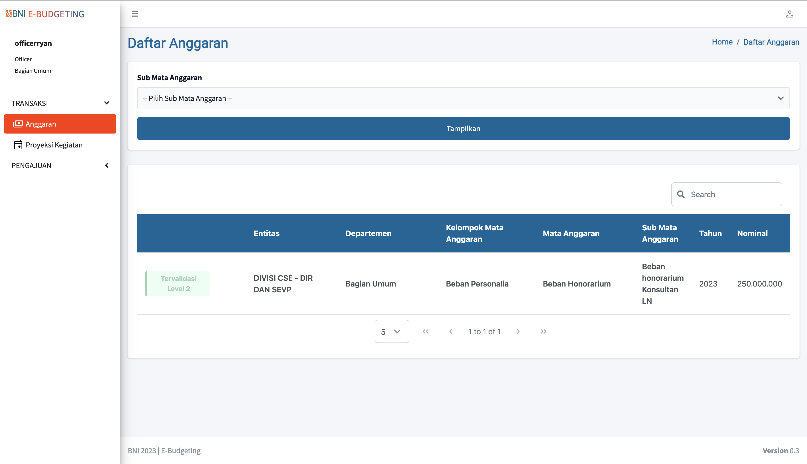

# webapp | E-budgeting



## Project setup for development
```
- npm install
- npm run serve

```

## Project setup for production
```
- change env file VUE_APP_URL="--your-endpoint-url"
- npm install
- npm run build
- docker build -t ebudgeting/web .
- docker run -d -p 8000:80 --name ebudgeting-web ebudgeting/web

```
## note for optimal
- setelah di build pisahkan folder dist dan dockerfile dari folder source code lalu jalankan command docker
- delete folder source code dari server
- simpan source code hanya di repository github/gitlab
